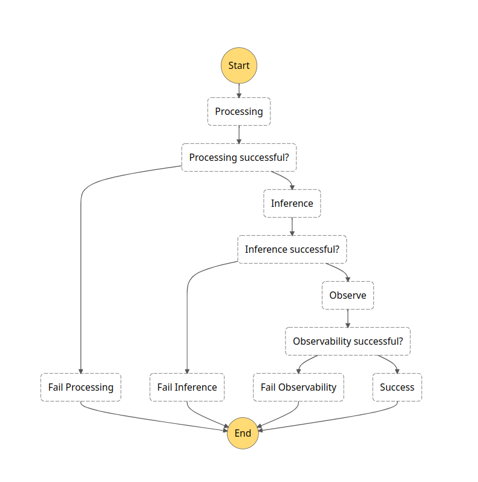
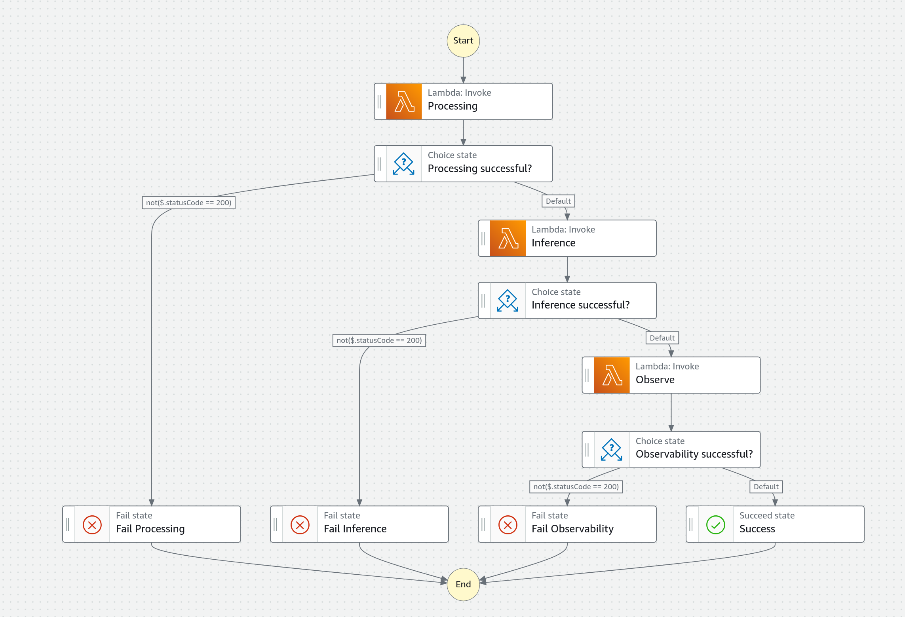
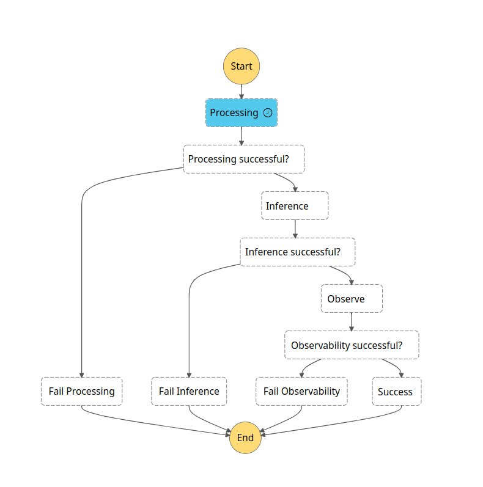
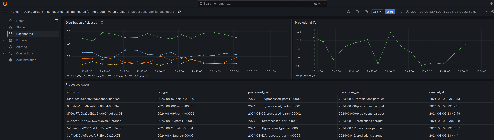
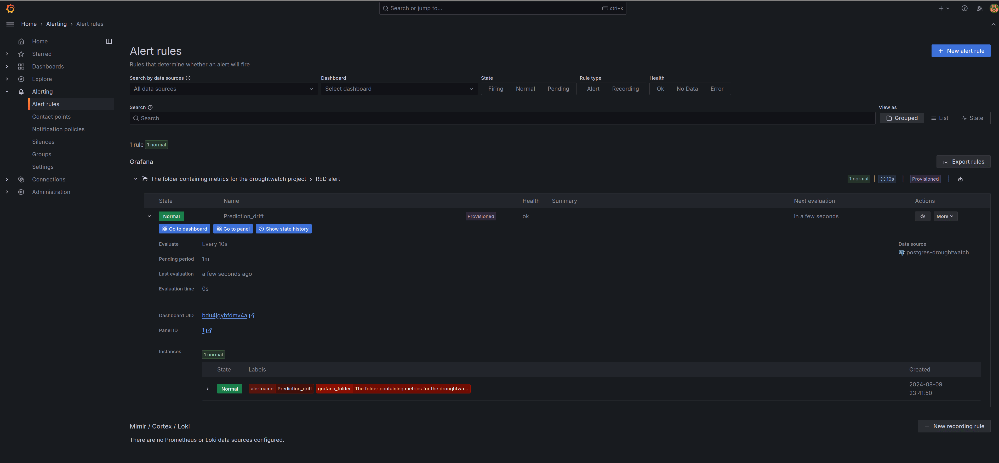

# The inference pipeline
## Overview
Since in this project we are focusing on satellite data, we choose the batch model of inference, where new data will be placed in a particular location (concretely on AWS S3) and the pipeline is run on a certain cadence to process new images. There's no need for asynchronous or streaming inference here and this keeps costs down.

The inference pipeline is run on the AWS cloud and is orchestrated via [AWS StepFunctions](https://aws.amazon.com/step-functions/). StepFunctions are a robust and easy-to-use tool to build workflows. They feature a graphical editor that can be used to construct workflows, as well as a custom, json-like DSL for a more programmatic approach. The workflow is represented in terms of a state-machine where every node represents a state (e.g. task or choice) and every edge represents a transformation from one state to another. The schematic of the pipeline can be seen below:



The three tasks here are, of course:

- Processing: turn raw data into processed data ready to be used for the model. This reuses the [same code]() that was used for this purpose in the training pipeline.
- Inference: the model is loaded and is run on the data to produce predictions for the label of every image.
- Observe: a set of metrics looking at the behaviour of the model is computed using `Evidently`:
    1. The class distribution (i.e., what share of all the predictions fall in each class) as measured by the $\chi^{2}$ [test](https://docs.evidentlyai.com/reference/data-drift-algorithm).
    2. The prediction drift: a measure of the difference between the distribution of predictions classes on the new data vs the distribution on the training data (note: for simplicity we used synthetic reference data in this project that simply reflects the true underlying class distribution of the data).


Each task is followed by a choice node, which checks the output of the task. Depending on the task's success or failure it continues along the graph to the correct next step. In the above, all successful executions take the _right_ branch.

## Implementation
On a more concrete implementation level, the three tasks above are done by three AWS Lambda functions:



The [code](https://github.com/SergeiOssokine/droughtwatch_capstone/tree/main/inference/setup) for the three functions are all packaged in a single Docker image and the correct handler is chosen as appropriate.

The Lambda functions need access to several other AWS services:

- AWS Elastic Container Registry (ECR): This stores the actual image used by the Lambda functions.
- AWS S3:

    1. A model bucket stores the model that we uploaded to S3 at the end of the training pipeline.
    2. A bucket for new inference data stores incoming data and writes the processed data results and predictions.

- AWS Relational Database Service (RDS) where a PostgreSQL database is used for two tasks:

    1. Keeping track of which tasks have been completed on which files, in the `ledger` table. This ensures that only new data is processed and thus no resources are wasted.
    2. Recording a set of metrics in the `metrics` table, computed with `Evidently`. These metrics are subsequently visualised in a dashboard. See [below](#observability).

- AWS Secrets Manager: Since we are connecting to RDS, we need to securely store credentials.

In order to schedule the execution of the AWS StepFunction state machine, we use AWS EventBridge scheduler, which is basically just a CRON job that runs on a given cadence. By default, this is 24 hours.

Finally, for the observability dashboard, we elect to run a local `Grafana` server in `Docker`. In order for this server to be able to access the data in the AWS RDS database, we set up an EC2 instance in the same network as RDS and create an ssh tunnel to forward the information.

Thus, the complete system looks as follows:


To provision these resouces, we use Terraform (both for AWS resouces _and_ the local Grafana dashboard). The necessary variables are all configured automatically with `setup_inference_infra`, except for sensitive values (the database credentials and ssh key for ssh tunnel connection). You can find the Terraform infrastructure [here](https://github.com/SergeiOssokine/droughtwatch_capstone/tree/main/inference/setup/tf) for AWS resources in the inference step, and [here](https://github.com/SergeiOssokine/droughtwatch_capstone/tree/main/inference/observability/tf) for local `Grafana`/`Docker` resources in the observability step. A complete, automatically-generated list of all AWS resources, can be found [here](tf_aws.md).


### Running inference on new data
As mentioned in the user guide, you can automatically upload some new data sets to S3 and trigger the pipeline on each by using:

```bash
make upload_and_run_inference
```
You can follow along with the execution by heading to the [AWS CloudConsole](https://console.aws.amazon.com/states/home) in the StepFunctions service, where you should see the `droughtwatch-inference` state machine. Clicking it will show a list of executions. Clicking on one which is still running will show you a live step-by-step progress of the pipeline, along with convenient links to AWS CloudWatch logs of the Lambda function executions. If all goes well, you should see things proceed as follows:



Every step of the pipeline can be monitored, and if a particular step fails, one receives a message with the traceback. An example (triggered purposefully) can be seen below:


### Observability
Using the ssh tunnel, the RDS database can be accessed on the local host at the usual port 5432. As discussed in the user guide, the command `make setup_inference_observability` will ensure everything is ready. Going to `http://localhost:3000` and logging in with the default credentials (`admin:admin`), click on `Dashboards` in the menu and navigate to the the only folder present. Then click on "Model Observability Dashboard". Because the time of execution is not known in advance, you will have to click "Zoom to data" and you should see something like the following:



The top two panels show the prediction class distribution and the prediction drift respectively. This gives us an at-a-glance view of how the mode is behaving. The bottom half of the dashboard displays the contents of the ledger table, which shows which data files have been processed and when.

In addition, we have created a Grafana alert, seen here:



This alert will trigger if the prediction drift exceeds a threshold of 25%.
