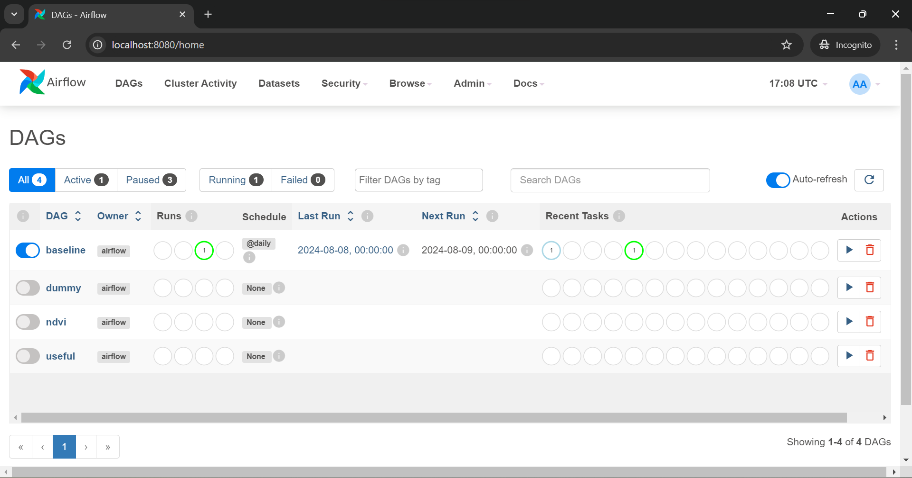
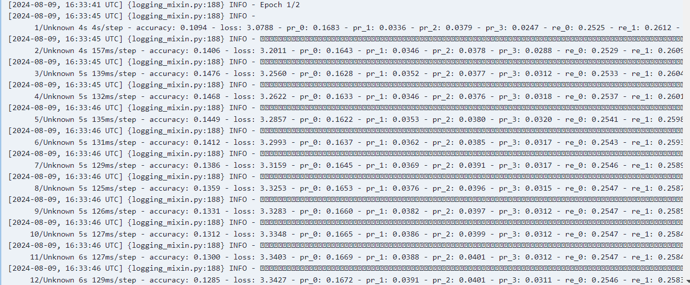
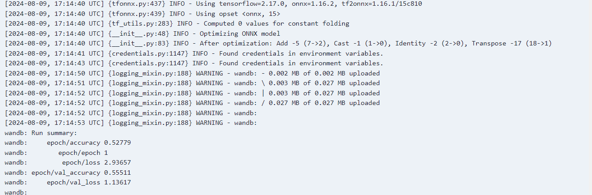
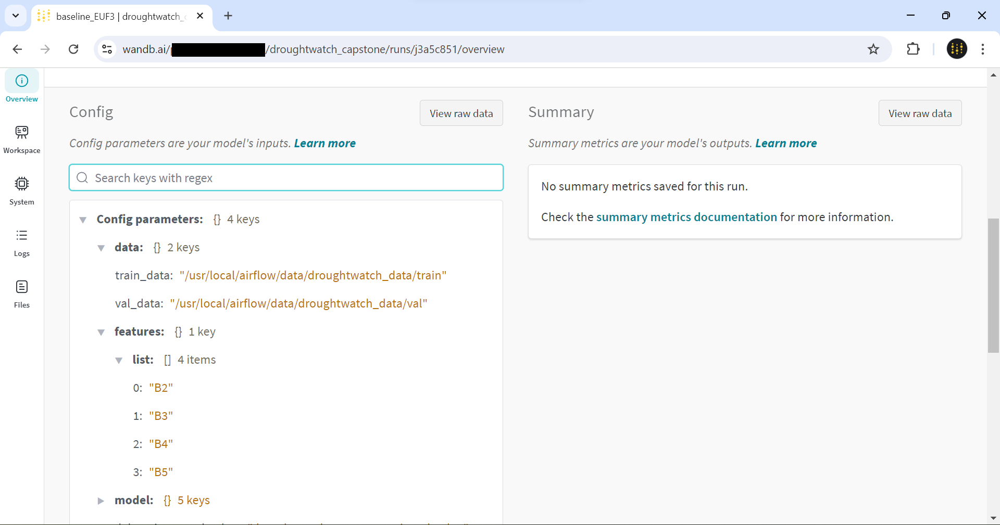
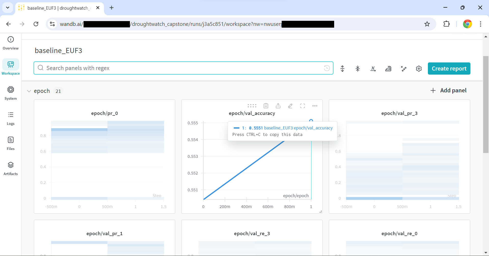
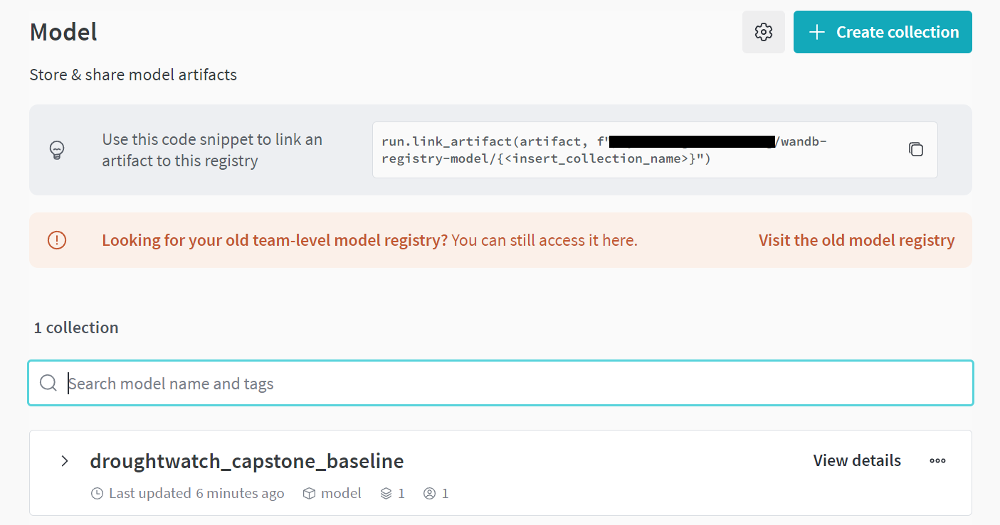
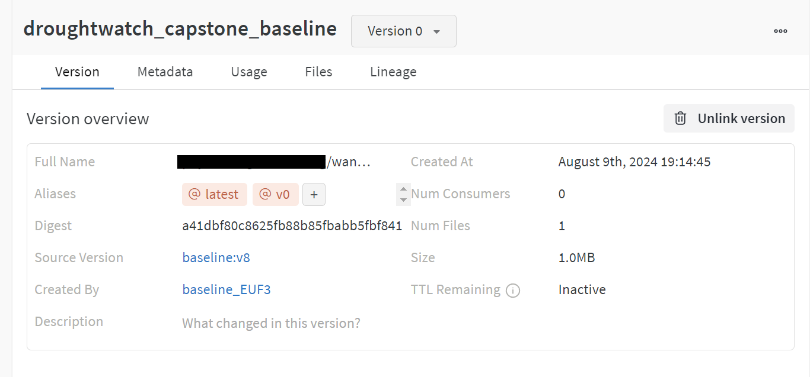
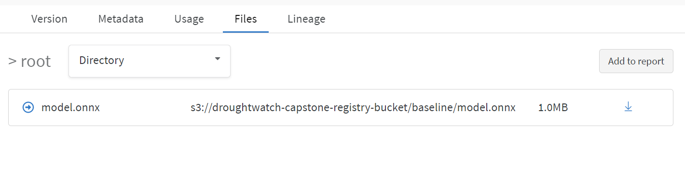

# The training pipeline
## Overview
The training process is orchastrated using [Apache Airflow](https://airflow.apache.org/docs/apache-airflow/stable/index.html). Airflow is a mature, robust and well-documented open-soruce workflow engine, that is [extremely widely used](https://www.astronomer.io/state-of-airflow/).

The diagram below shows the overall architecture of the training pipeline. The entire training environment is inside a Docker container for reproducibility and ease of deployment.

The tasks to be performed are organized in DAGs (Directed Acyclic Graphs), where each node corresponds to a given task. Airflow keeps track of the dependencies between tasks, as well as the logging of each task execution and the scheduling of the DAGs. Given that our model uses a large amount of data, we didn't opt to add the downloading of the raw data as a task in a DAG, instead having [a script](https://github.com/SergeiOssokine/droughtwatch_capstone/blob/main/utils/download_data.py) that downloads the data to local storage.

The raw data is in the form of about a hundred of Tensforflow [TFRecord files](https://www.tensorflow.org/tutorials/load_data/tfrecord), which is an efficient binary storage format for Tensor data sets. The raw data is not quite suitable for training and thus we transform it by:
- normalizing the data in every band to be in the range [0,1]
- vetoing completely blank observations (defined as having no intensity in any pixel in any band)

We also add several derived features which can be useful in training, namely:

- Normalized Difference Vegetative Index (NDVI)
- Normalized Difference Moisture Index (NDMI)
- Enhanced Vegetative Index (EVI)

These indices are constructed specifically to assess the presence of vegetation and moisture from satallite imagery. For more information, see [here](https://www.usgs.gov/landsat-missions/landsat-surface-reflectance-derived-spectral-indices) The updated data is then written back to disk as TFRecord files, so that it can be used for training.

The model is constructed in Keras and then trained on the processed data. During this process, the user has a choice of which experimentation tracking system to use. By default, the code uses [Weights and Biases Cloud platform](https://wandb.ai/). This allows for easy, convenient and comprehensive tracking. The other choice is MLFlow, which runs in the same container as the Airflow server. After the model is trained, depending on the settings, it is promoted to the model registry, either in WandB or MLFlow. Regardless of the service used, the model is also uploaded to S3 so it can be used later for inference. To ensure maximum efficiency and portability, the model is converted from the native Keras format to the [ONNX standard](https://onnx.ai/) which produces highly efficient models for inference.

**Thus the basic DAG has two steps: i) Data processing ii) Model training.**

## The model
The model we choose to be the base for this project is a simple CNN architecture, since modelling is not the focus of this project. This model takes in images in any of the provided bands/derived features and attempts to predict the labels, which correspond to the number of goats that can be supported. The summary of the baseline model can be seen below:

The training data contains  a class imbalance: 60% of all labels are of class 0 (poor forage quality). To compensate we use direct class weights defined as follows:

- class 0: 1
- class 1: 4
- class 2: 4
- class 3: 6

We use a standard cross-entropy categorical loss. The user can eaily adjust the following parameters through the config files:

- learning rate
- batch size
- list of features to use

For simplicity, only the baseline model is set to be commited to the model registry. In reality one would run a whole series of experiments and then pick the model based on the results. However, we also provide DAGs to train some other models, that vary the features that the model is trained on as well as the amount of epochs the model is trained.

## Airflow pipeline in detail
### Code structure
All the DAGs are currently defined in [one file](https://github.com/SergeiOssokine/droughtwatch_capstone/blob/main/training/airflow/dags/pipeline.py). This choice was made in order to [eaily reuse](https://github.com/SergeiOssokine/droughtwatch_capstone/blob/main/training/airflow/dags/pipeline.py#L17) the first part of any DAG, which is to preprocess the data. There are only 2 tasks in each DAG, each defined as a `PythonOperator`, which is just a Python function. We separate the the actual code that does the tasks from the task definitions, with the preprocessing done [here](https://github.com/SergeiOssokine/droughtwatch_capstone/blob/main/training/airflow/includes/parse_data.py) and the training [here](https://github.com/SergeiOssokine/droughtwatch_capstone/blob/main/training/airflow/includes/train.py). There is extensive logging to enable easier debugging, as well as [unit tests](https://github.com/SergeiOssokine/droughtwatch_capstone/blob/main/tests/unit_tests/test_parse_data.py) to test some of the functionality.

### Airflow UI exploration
Once the training pipeline has been deployed as described [here](), its state can be easily examined in the Airflow UI and it can be seen below:

By default, all the DAGs we included are paused, which means that they are inactive. The `baseline` DAG is scheduled to run at midnight every day, while the rest (the models for experimentation) are required to be manually triggered (which can be done in the UI by pressing the "play" button). Using either the provided `make train_baseline` command, or the UI we can unpause the baseline DAG which will cause it to run, as illustrated below.

Clicking on the DAG name will show the overview screen. From here one can see the actual graph itself by navigating to the `Graph` section.
To see the process of execution, click on any of the boxes and then click "Logs". An example for the training task can be seen below

When everything is finished you will see (if you used WandB for logging):

### WandB UI Exploration

When the training task from the baseline DAG starts executing, it will create a project called `droughtwatch_capstone` in the default namespace. Clicking on it will bring up a list of runs, which should now contain something like `baseline_XXXX` where the `XXXX` is generated randomly as an ID for the run. Clicking "Overview" in the left panel menu will bring up some general information about the run and the hardware it is being run on:

Scrolling down we can see some of the things WandB has already logged:

Once the run has a couple of epochs, click on "Worksapce" to see some of the logged metrics:

The logged metrics are (these are logged for both the training set and for the validation set):

- Precision and recall for every class (`pr_*` and `re_*`). These are arrays _at every epoch_ since they correspond to the precision and recall on a _set_ of thresholds, allowing one to construct the `precision-recall` or alterntively ROC curve for every class at every epoch
- Accuracy
- Loss

Once the run is complete,if it was configured to do so, it is automatically added to the model registry (by default only the baseline model is configured to be added):

Clicking on the collection also shows the model lineage, linking the model with the run:

Finally one can examine the link to S3 by clicking on the "Files" tab, to see

